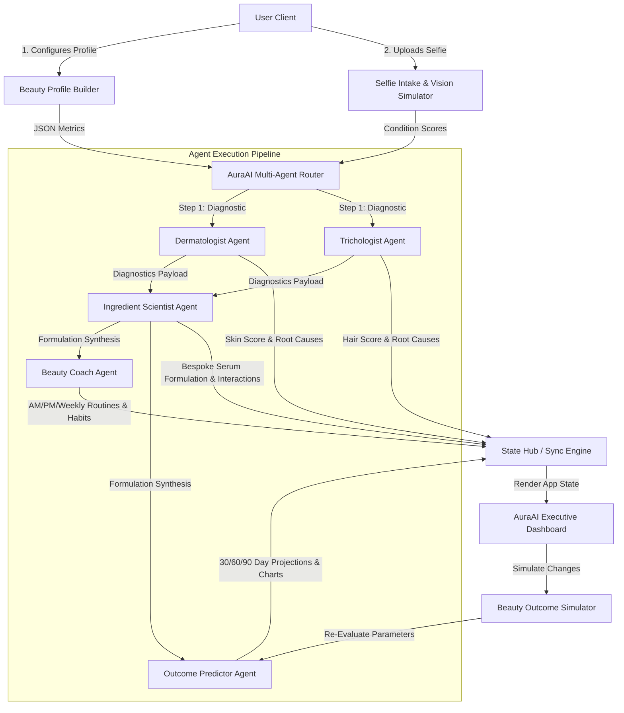

# AuraAI — Technical Architecture

AuraAI is engineered as a high-performance, multi-agent AI beauty intelligence platform. It utilizes a modular, decoupled frontend-client architecture coupled with a deterministic agent router simulating real-world clinical evaluation workflows.

---

## High-Level Architecture Diagram

---

## Structural Components

### 1. Client & State Management Layer
* **React & React-Router-DOM (v6)**: Coordinates the single-page application flow, ensuring smooth transitions between onboarding, evaluation, and dashboard.
* **AuraContext (State Hub)**: A centralized context engine that manages the active user session, diagnostic payloads, history, and simulation states.
* **Framer Motion**: Powering fluid, hardware-accelerated animations, micro-interactions, and visual transitions between steps.

### 2. Multi-Agent Router (`src/services/aiEngine.js`)
Orchestrates a simulated cascading pipeline of five domain-specific LLM agents using highly optimized XML-delimited prompts.
* **Dermatologist Agent**: Analyzes skin metrics (Acne, Redness, Pigmentation, Oiliness) against lifestyle factors to identify root causes and compute skin health indexes.
* **Trichologist Agent**: Evaluates scalp and hair fiber condition, detecting concerns like hair fall severity, density issues, and barrier dryness.
* **Ingredient Scientist Agent**: Consumes diagnostic logs from both agents, performs lookup against an active compound database, flags chemical interactions/risks, and synthesizes a bespoke serum.
* **Beauty Coach Agent**: Designs a dynamic morning, evening, and weekly protocol customized to the user's skin type, goals, and active formulation.
* **Outcome Predictor Agent**: Runs regression models forecasting skin & hair scores over a 90-day trajectory based on lifestyle parameters and routine adherence.

### 3. Visual & Interactive Analytics
* **Recharts**: Renders real-time interactive charts displaying 90-day trajectory forecasts, skin vs. hair progress, and historical trends.
* **Outcome Simulator Engine**: Interactive sandbox enabling real-time adjustments to lifestyle metrics (Sleep, Hydration, Stress, Adherence) to preview visual and analytical before/after states.

---

## Data Model & Flows

### Agent Request/Response Flow
1. **Onboarding**: User completes intake, providing age, skin/hair types, baseline lifestyle habits (sleep hours, water intake, stress levels), and beauty goals.
2. **Analysis Trigger**: The system initiates `runFullAnalysis()`.
3. **Step 1 (Parallel)**: `runDermatologist()` and `runTrichologist()` execute, generating diagnostic scores, concern arrays, root causes, and confidence thresholds.
4. **Step 2 (Sequential)**: `runIngredientScientist()` receives the diagnostic reports, matches against active compounds, checks contraindications (e.g., Retinol + Vitamin C conflicts), and drafts a custom formulation.
5. **Step 3 (Sequential)**: `runBeautyCoach()` compiles custom Morning/Night/Weekly routines, while `runOutcomePredictor()` generates baseline trajectories.
6. **State Synchronization**: All agent payloads compile into a master JSON object, appended to the user's history, and rendered on the Executive Dashboard.
